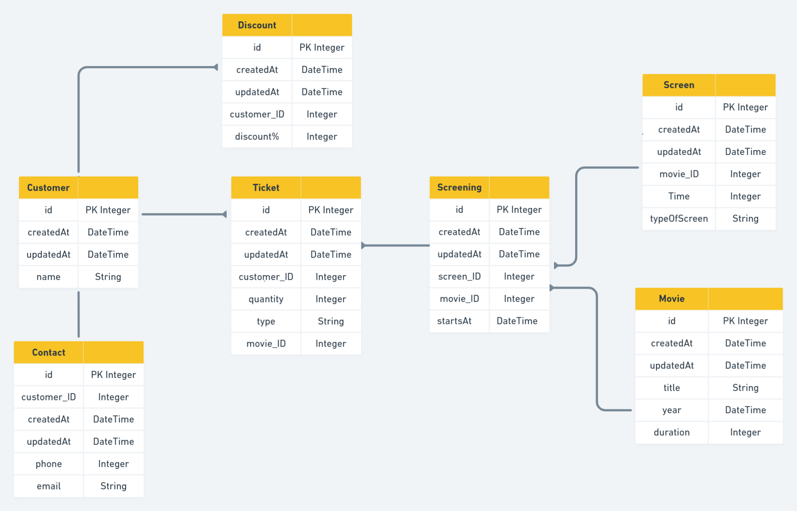

- As a customer, so I can receive my tickets, I want to provide my contact information.
- As a customer, so I can decide which movie I want to watch, I want to see a list of movies.
-As a customer, I can see the title, genre and year of movies.
-As a customer, I like to get a discount for my loyalty.
- As an admin, so I can manage the movies shown at the cinema, I want to update the list of movies.
-As an admin, I can choose in which screen, each movie should display.
-As an admin, I may decide to expand the number of screens and brings more movies to the cinema.
-As an admin, I can see the number of tickets for each movies.
-As an admin, I can offer discounts and promo codes for loyal customers and update or manage discount amounts.

